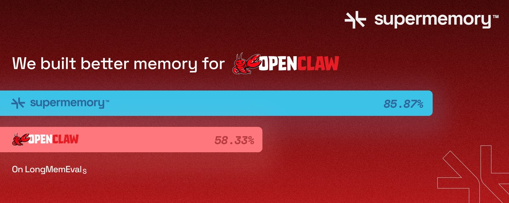
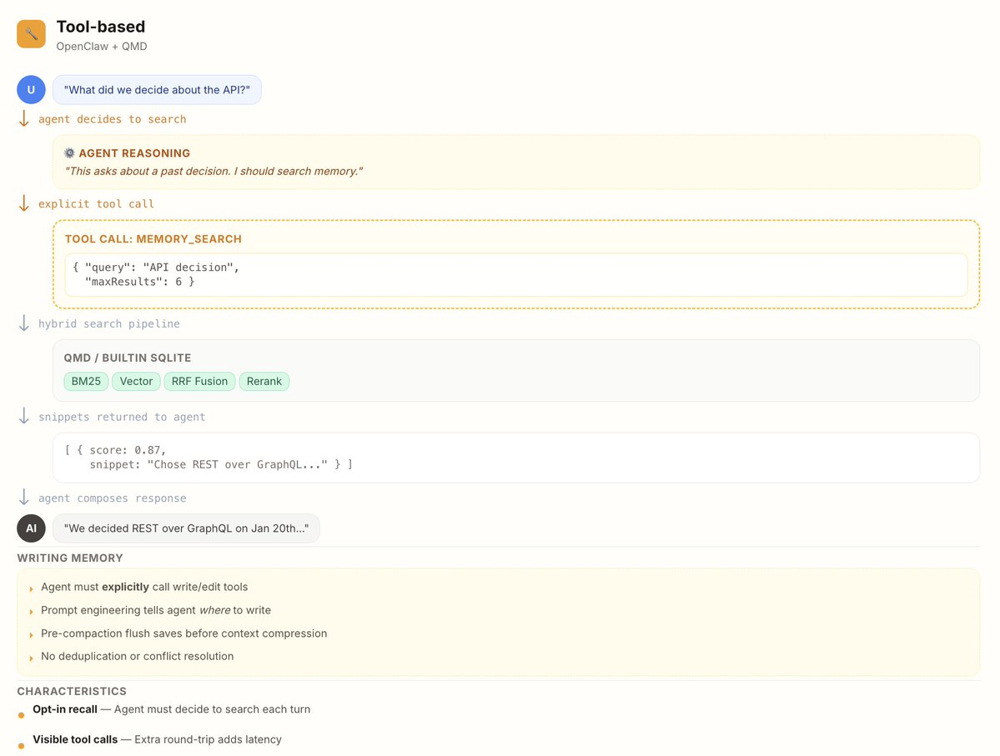
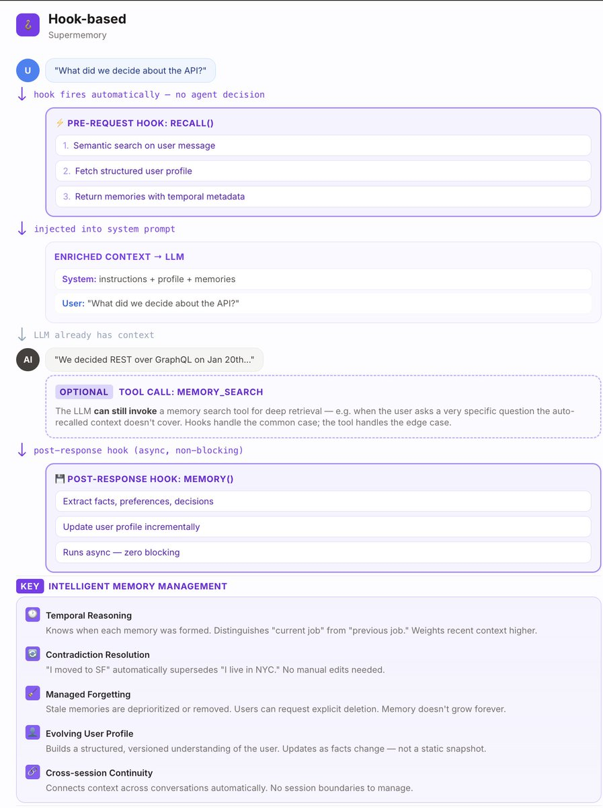

# Why everyone is complaining about OpenClaw's memory (it sucks) - and why supermemory fixes it

> **Author**: Dhravya Shah ([@DhravyaShah](https://x.com/DhravyaShah))
> **Date**: Feb 17, 2026
> **Original**: [https://x.com/DhravyaShah/status/2023630749065228364](https://x.com/DhravyaShah/status/2023630749065228364)
> **Stats**: 13 replies · 18 reposts · 153 likes · 232 bookmarks · 27.5K views

---

**TLDR:** Today, we are releasing a new version of our openclaw plugin - [https://github.com/supermemoryai/openclaw-supermemory](https://github.com/supermemoryai/openclaw-supermemory). This post is going to be a bit technical, so bear with me (or bookmark for later!)

In this post, I will talk about what we do about OpenClaw memory, and how we fix it. BENCHMARKS AT THE END!!! :)

It's been about two weeks since [@OpenClaw](https://x.com/OpenClaw) absolutely took over the internet. Everyone's been talking about it - the things it can do, how it can connect to all our tools, and how we can chat with it on our preferred messaging platform. This always-running, always working assistant.

It's biggest problem? **Memory.**

It's not just me saying it. just do an x search about openclaw memory. no one has good things to say about it :(

We launched our plugin a [few weeks ago](https://x.com/DhravyaShah/status/2016308406701981731) (it got 500k views!!), and it is much-loved! Today, we are publishing an even better version, with auto-routing containerTags and better configurability.

Openclaw obviously saw this - and they even added the QMD memory plugin. This should fix it, right???? ....Even this morning, I woke up to this post by [@Levelsio](https://x.com/Levelsio) - and I did my usual plug, talking about the [@supermemory](https://x.com/supermemory) plug etc. etc.

> **@levelsio** · Feb 16
> How did you guys fix persistent memory with OpenClaw? My bot keeps forgetting stuff, I already have qmd installed
> *521 replies · 89 reposts · 2.4K likes · 736K views*

And, to my surprise, MANY recommended supermemory. But why? What do we do differently that the built-in version does not? How is it different from filesystem? or QMD? How does it compare on the benchmarks? I kept getting these questions - so here's a practical, technical explanation of what supermemory does differently.

## OpenClaw's memory problems

To understand this well, we first need to learn exactly how openclaw remembers things.

It has a **Two-layer storage:**

- `memory/YYYY-MM-DD.md` — daily append-only logs. The agent reads today + yesterday at session start. Think of it as a scratchpad for running context.
- `MEMORY.md` — curated long-term facts, preferences, decisions. Only loaded in private/DM sessions (never group chats, for privacy).

**Two tools (read-side):**

- `memory_search` — semantic search over all memory files. Returns snippets with file path, line range, and score. Mandatory before answering anything about prior work, decisions, dates, people, preferences.
- `memory_get` — read specific lines from a file after finding them via search.

**The problem?**

- **It uses tools, not hooks.** Because it is highly reliant on tools, you are always expecting the main agent to UTILIZE the tools to do any memory operation. You tell OpenClaw your name? It has to spend tokens and time to save it, using a tool. You ask it a basic question? you have to ask it to use the memory tool to actually collect the context to answer the question. This approach is rather slow, but also context is only fetched when you need it. *The problem? Counterintuitively, this uses MORE, not LESS tokens - because the tool call etc are expensive too!*
- **It does not handle knowledge updates, temporal reasoning, multi-session context well.** When saving new things to memory, it has no idea of what's already in there (Unless you explicitly ask it to traverse through the whole memory again). This leads to it being a bit stupid when adding things, as it will add redundant information, not "update" existing knowledge, and generally not build on top of everything it knows about you.
- **It does not forget.** Forgetfulness is more important than you think. This is the primary way to keep the context fresh and useful, even after time has passed.

## How @supermemory fixes it

We have been building the context infrastructure for agent memory for years now. Throughout this time, we have learnt and built something that we think is ideal for the age of OpenClaw.

**What's different?** Supermemory is built with a vector-graph layer, which automatically learns and updates it's knowledge about users. It comes with Knowledge updates, temporal reasoning, and other things. Every fact is built on top of other facts, and it's always contextual.

For the plugin, we make use of **HOOKS**. The saves happen implicitly, in the background, with both the memories extracted out of it, as well as the raw chunks being saved. This is mainly because we don't know what to "remember" on ingestion time - so if something was not remembered, the chunk referencing it will show up to provide context. But it will always be there.

Importantly, this memory system also **forgets!** Irrelevant information over a long time horizon will automatically decay and be forgotten, unlike static markdown files.

*claude helped me with a nice UI to put this in picture*

It is pretty important to note that despite this, the Supermemory Openclaw plugin STILL has some tools that it can optionally call, to either get things from other memory buckets, talk to other agents, or getting more information.

## Ok so the architecture is better. but benchmarks?

To verify our claims, we ran supermemory against both - OpenClaw's memory system as well as Claude code's memory system, on our open source memory evaluation platform, Memory Bench.

[https://github.com/supermemoryai/memorybench](https://github.com/supermemoryai/memorybench)

Supermemory consistently scored **31.7 percentage better** across the board.

- **Filesystem (Claude code's memory):** 54.2%
- **RAG (OpenClaw's memory):** 58.3% *Note that this is expecting that the memory tool is actually called.*
- **Supermemory:** 85.9% *Automatic, implicit!*

The supermemory plugin also saves on tokens used (by the LLM provider), so it ends up being better, faster AND cheaper. Yeah. that's right.

You can use it today. Just go here or ask openclaw to set it up for you. Premium memory for all your services, for just $20/month - [https://github.com/supermemoryai/openclaw-supermemory](https://github.com/supermemoryai/openclaw-supermemory)
